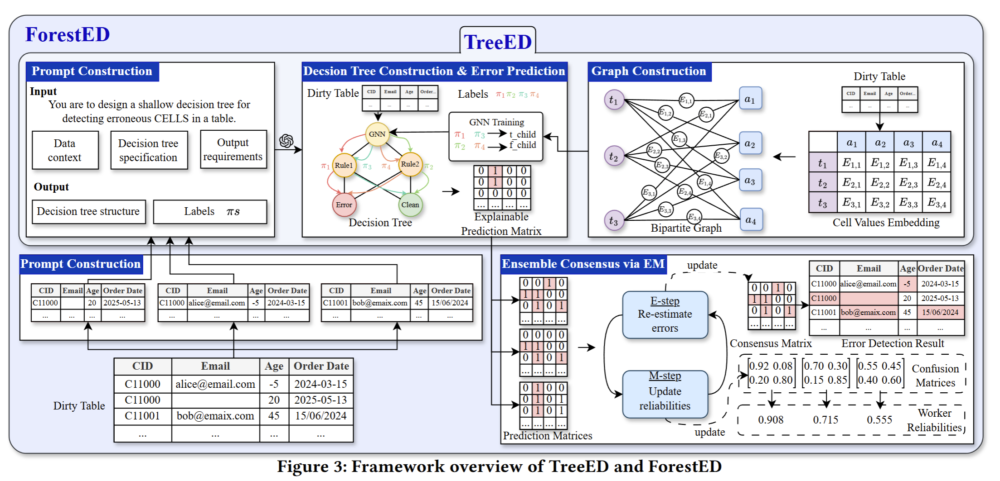

# Error Detection Pipeline (ForestED)




This repository provides the codebase for the paper **Ensembling LLM-Induced Decision Trees for Explainable and Robust Error Detection**, including:


1. Building a Data Catalog  
2. Sampling rows using GP-based uncertainty  
3. Running the Decision Forest (ForestED) Error Detection Model  

---

## 1. Build a Data Catalog

The data catalog extracts column profiles, statistical summaries, value distributions, and metadata from the input CSV.

**Run:**
```bash
python3 build_data_catalog.py path/to/table.csv --out path/to/catalog.json
```

## 2. Generate Samples

To reduce LLM cost and guide tree induction, the system uses Gaussian Process (GP) uncertainty sampling to select ~5% of rows.

Run:
```bash
python3 sample_gp.py input.csv --out sample.csv --frac 0.05
```
3. Run Error Detection Using Decision Forest

After preparing

Run the full ForestED error detection pipeline:
```bash
python3 decision_forest.py \
    --clean ./data/hospital_clean.csv \
    --dirty ./data/hospital_error-01.csv \
    --catalog ./data/hospital_error-01_catalog_1.json \
    --outdir ./data/hospital_output

```